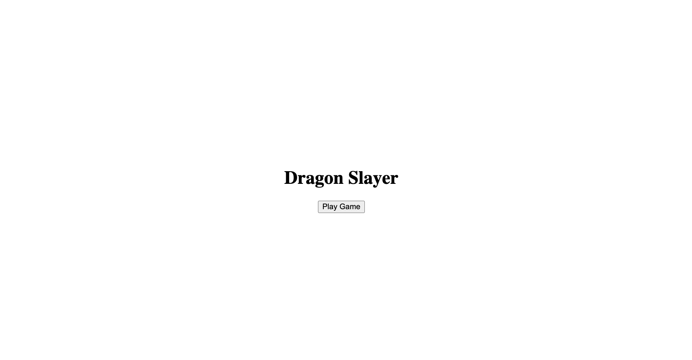
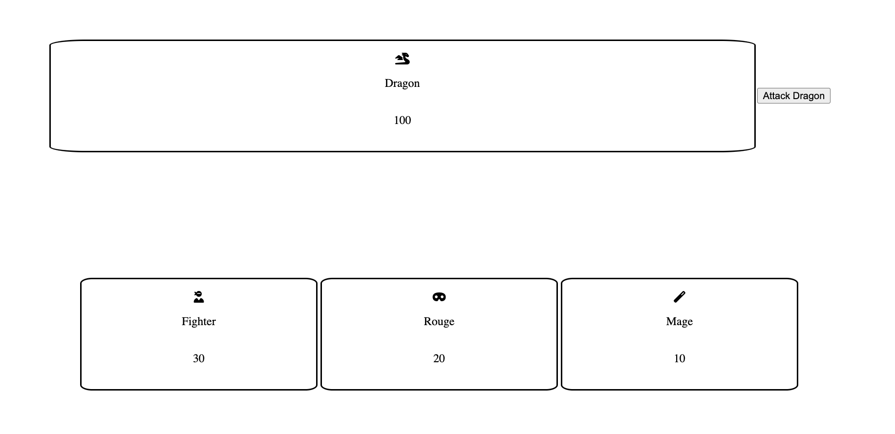

# Dragon Slayer

Dragon Slayer is a simple game where 3 characters try to take down a dragon.

## Technology Used

The following technology was used in order to create Dragon Slayer:

- JavaScript
- HTML
- CSS

## Getting Started

To play this game live you can click this [link]()

Instructions:

- Click on the play game button on the landing page
- Once over on the game screen click the `Attack Dragon` button until either the dragon or the 3 characters lose all their health

## Next Steps

Version 2:

- As a user I want to be able to select a single character and damage the dragon
- As a user I want the dragon to be able to dodge an attack

Version 3:

- As a user I want to see the dragon and the characters on a grid of 9x9
- As a user I want to be able to move a single character